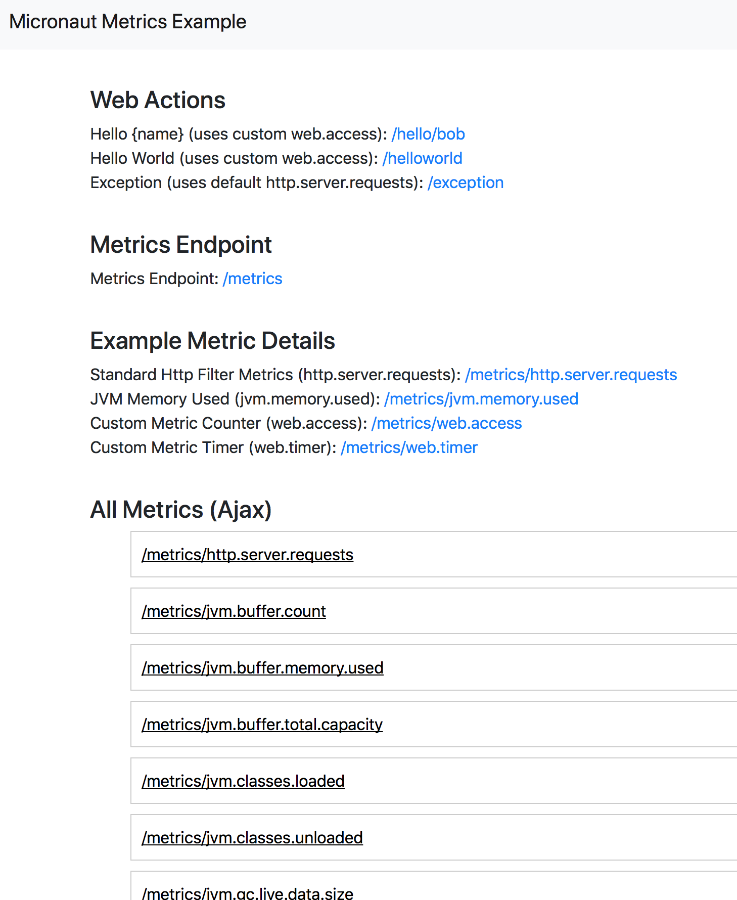

# Micronaut Metrics Example

An example project with some custom metrics and links to using metrics.

`mvn compile exec:exec`

This will start a server on host:port `http://localhost:8181`



The following is a few very contrived examples that the index controller uses for custom metrics. By default, the web filter does what these custom metrics do under the `http.server.requests` metric automatically.	`

```java
package io.micronaut.examples;

import io.micrometer.core.instrument.MeterRegistry;
import io.micronaut.http.HttpResponse;
import io.micronaut.http.MediaType;
import io.micronaut.http.annotation.Controller;
import io.micronaut.http.annotation.Get;
import io.micronaut.http.annotation.Produces;
import io.micronaut.validation.Validated;
import io.reactivex.Single;

import javax.validation.constraints.NotBlank;
import java.net.URI;

@Controller("/")
@Validated
public class IndexController {

    private MeterRegistry meterRegistry;

    public IndexController(MeterRegistry meterRegistry) {
        this.meterRegistry = meterRegistry;
    }

    @Produces(MediaType.TEXT_HTML)
    @Get(uri = "/")
    HttpResponse index() {
        meterRegistry
                .counter("web.access", "controller", "index", "action", "index")
                .increment();
        return HttpResponse.redirect(URI.create("/index.html"));
    }

    @Get("/exception")
    public Single exception() {
        throw new RuntimeException("Bad Request");
    }

    @Get("/hello/{name}")
    public Single hello(@NotBlank String name) {
        meterRegistry
                .counter("web.access", "controller", "index", "action", "hello")
                .increment();
        return meterRegistry
                .timer("web.timer", "controller", "index", "action", "hello")
                .record(() -> Single.just("Hello " + name));
    }

    @Get("/helloworld")
    public Single helloworld() {
        meterRegistry
                .counter("web.access", "controller", "index", "action", "helloworld")
                .increment();
        return meterRegistry
                .timer("web.timer", "controller", "index", "action", "hello")
                .record(() -> Single.just("Hello World!"));
    }
}
```
## Filters

The following is an example of adding some filters.  To enable then in this example, set the `example.metric.filters.enabled` to true in the application.yml.

```java
package io.micronaut.examples;

import io.micrometer.core.instrument.Tag;
import io.micrometer.core.instrument.config.MeterFilter;
import io.micronaut.context.annotation.Bean;
import io.micronaut.context.annotation.Factory;

import javax.inject.Singleton;
import java.util.Arrays;

@Factory
public class MeterFilterFactory {

    /**
     * Exclude metrics starting with jvm
     *
     * @return meter filter
     */
    @Bean
    @Singleton
    MeterFilter jvmExclusionFilter() {
        return MeterFilter.denyNameStartsWith("jvm");
    }

    /**
     * Add global tags to all metrics
     *
     * @return meter filter
     */
    @Bean
    @Singleton
    MeterFilter addCommonTagFilter() {
        return MeterFilter.commonTags(Arrays.asList(Tag.of("scope", "demo")));
    }

    /**
     * Rename a tag key for every metric beginning with a given prefix.
     * <p>
     * This will rename the metric name http.server.requests tag value called `method` to `httpmethod`
     * <p>
     * OLD: http.server.requests ['method':'GET", ...]
     * NEW: http.server.requests ['httpmethod':'GET", ...]
     *
     * @return meter filter
     */
    @Bean
    @Singleton
    MeterFilter renameFilter() {
        return MeterFilter.renameTag("http.server.requests", "method", "httpmethod");
    }
}

```